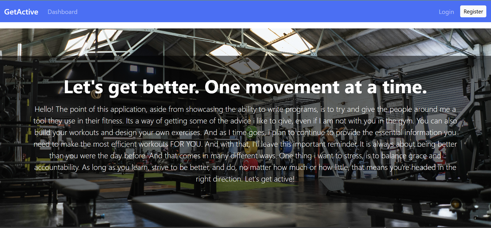

# GetActive_Frontend

## Overview

This is the front end portion of my full stack application, GetActive. 

### The challenge

Users should be able to:

- View the optimal layout for each page depending on their device's screen size
- See hover states for all interactive elements on the page
- See the IP address of the Superbowl Champions on the map on the initial page load
- Search for any IP addresses or domains and see the key information and location

### Screenshot

### Links

Render Deployment:  https://getactive-frontend.onrender.com/

### My process 

This was the portion of the project i thought about the most, and spent the most amount of time on. The biggest thing i wanted to achieve, was to make a workoable front end, that looked nice, but i didnt want to go overboard. In some ways, i felt i just went overboard in other ways, like putting everything into just the dashboard, as opposed to splitting between dashboard, list and item.  

I anticipated the api calls from the front end would be a challenge, and they definitely were. WHat helped immensely wss coming up with the core exercises idea. I did that originally as an opportunity to share knowledge. It ended up working to also give me an avenue to get a successful api call in order to just build confidence for the other calls.  

In terms of how I moved through the project, i set up benchmarks for things i wanted to achieve. Basic file setup, page setup and then functionality governed the milestones. First was the fetch call for the core exercises and setting up where that data was housed. Next was register, then log in and so on. I find going by functionality milestones determined by user stories really helps me to keep track of where I'm at, and where I'm going. 

### Built with

- React (Javascript w SWC)
- React Router
- React Bootstrap
- CSS custom properties
- Vite
- Axios 
- 

### How to Use

FOr this front end applicatoin there are 2 key things you need to do to be able to properly test. The first is to run npm i in the terminal to install all necessary dependencies. 

You also need to create a .env file with the the variable VITE_SERVER_ORIGIN that connects to a backend. You can use this link for a backend :

https://github.com/VJQuiles/GetActive_Backend

And then you just have to ensure you have a mongodb account. More about backend set up in the backend readme in the above repo. 

### What I learned, a reflection

I anticipated coming into this portion of the project that it would give me some trouble. But there were some things i better understood coming into this project. The first and most important thing, is that research is part of the process. And it's okay to do some deep research before jumping in, as long as you're improving your understanding. 

One of the major things I tried to remember is that we are getting and manipulating data. That is programming in it's simplest form, and that is all I am doing here. I am taking information from the front end to send to the backend, and getting the desire information from the backend. 

This helped a lot with 2 different aspects I knew I had to strengthen would be useContext and how to handle token on the front end in order to access protected routes. 

Watching back some of the lessons from class, as well as watching videos on youtube also helped. I found webdevsimplified and fireship to have particularly useful videos. 

The other noticeable thing i experienced was stepping out of options paralysis and actually trying things to make 
### Resources

Code along videos from both class and office hours

Previous React Repos in my github. 

Many, many videos from you tube. The pages that stickout are web dev simplified, fireside and Codsen Solutions. I watched a lot of videos but these creators i found to be the most helpful. Particularly the use context videos they both made.

https://react.dev/reference/react

https://react-bootstrap.github.io/components/accordion/

https://developer.mozilla.org/docs/Web/CSS/background-image

https://axios-http.com/docs/interceptors

https://developer.mozilla.org/docs/Web/JavaScript/Reference/Global_Objects/Array/reduce

https://react.dev/reference/react/useContext

I have to transcribe my prep notes as they are written. 

# React + Vite

This template provides a minimal setup to get React working in Vite with HMR and some ESLint rules.

Currently, two official plugins are available:

- [@vitejs/plugin-react](https://github.com/vitejs/vite-plugin-react/blob/main/packages/plugin-react) uses [Babel](https://babeljs.io/) for Fast Refresh
- [@vitejs/plugin-react-swc](https://github.com/vitejs/vite-plugin-react/blob/main/packages/plugin-react-swc) uses [SWC](https://swc.rs/) for Fast Refresh

## Expanding the ESLint configuration

If you are developing a production application, we recommend using TypeScript with type-aware lint rules enabled. Check out the [TS template](https://github.com/vitejs/vite/tree/main/packages/create-vite/template-react-ts) for information on how to integrate TypeScript and [`typescript-eslint`](https://typescript-eslint.io) in your project.
